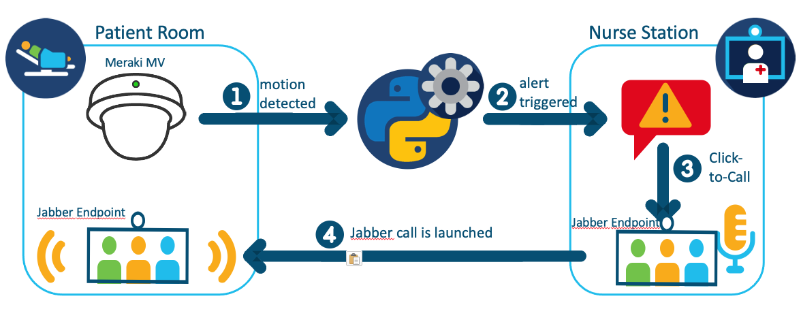
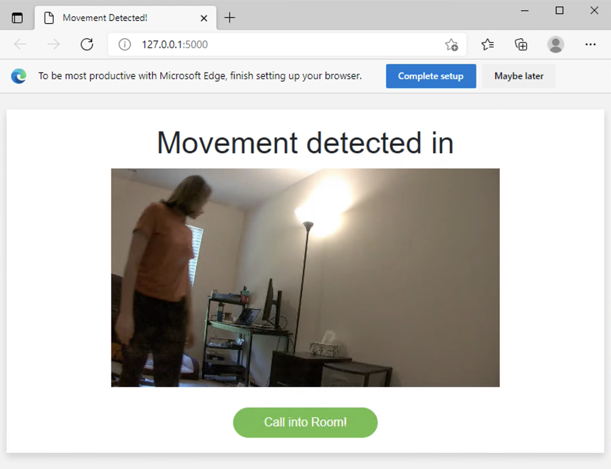

# Remote Patient Monitoring

An application utilizing Meraki MV cameras and Jabber endpoints to monitor and communicate with patients remotely. If movement is detected in a patient's room, an alert is triggered at the nurse's monitoring station. The nurse can then click to call into the patient's room to talk to him/her  directly.

## Overview
 

**Meraki MV Camera**: The [Meraki MV cameras](https://meraki.cisco.com/products/smart-cameras/) provide reliable security and valuable insights to organizations while being simple to deploy, configure, and manage. With its [APIs](https://developer.cisco.com/meraki/mv-sense/#!overview/introduction), the camera becomes a sensor and we can have smart cameras that can learn and provide more insights over time, that better understand people behavior patterns, and that provide context or trigger action in other systems. For this use case, we are using the [MQTT](https://developer.cisco.com/meraki/mv-sense/#!mqtt/what-is-mqtt) protocol to get notified when a MV Camera [detects motion in the camera's view](https://developer.cisco.com/meraki/mv-sense/#!mqtt/raw-detections-a-list-containing-object-identifiers-oids-and-their-x-y-coordinates). A snapshot of the room is included in the notification sent to the nurse's station using the [MV Sense REST API](https://developer.cisco.com/meraki/mv-sense/#!rest-api).

**Notification Screenshot**:

## Contacts
* Danielle Stacy (dastacy@cisco.com)

## Solution Components
* Meraki MV Cameras, incl. MV Sense MQTT and REST API
* Jabber/CUCM
* Python 3.8
* Flask

## Prerequisites
- **Meraki MV Cameras**: 
   - **MQTT Broker**: To configure the MQTT broker in the Meraki dashboard, follow [these steps](https://developer.cisco.com/meraki/mv-sense/#!mqtt/configuring-mqtt-in-the-dashboard). For testing, you can use a public broker (see examples [here](https://github.com/mqtt/mqtt.github.io/wiki/public_brokers)). Note down the MQTT broker IP address or domain name and the port. 
   - **Important Note on Number of Cameras/Rooms**: This use case was prototyped with access to only one camera. Some changes therefore need to be made when there are more rooms and cameras the MQTT broker listens to. This includes iterating over the rooms when multiple are listed in the `MerakiCameras_to_JabberRoom.csv` (compare for example to lines 39 to 42 and line 49 in `main.py` and line 15 in `web_app.py`) to ensure the right Jabber SIP address is included in the popup notification windows. As for the MQTT broker, you can have a look at [this use case](https://github.com/CiscoDevNet/Meraki-Camera-Notification).  
   - **MV Sense REST APIs**: You need to enable API access in the Meraki dashboard following [these steps](https://developer.cisco.com/meraki/mv-sense/#!rest-api/enable-api). Generate an API key as described in the instructions and note it down.
   - **Camera Setup**:
    - **Dashboard registration, serial numbers, and network ID**: The camera needs to be registered in your Meraki dashboard. You can find a setup guide [here](https://documentation.meraki.com/MV/MV_Quick_Start). You will also need the serial number of the camera and the network ID in which they are registered. You can retrieve it using this [API call](https://developer.cisco.com/meraki/api/#!get-organization-networks). You will save the value of the network ID in the credentials.yml file and the camera serial number in the `MerakiCameras_to_JabberRoom.csv` file, explained in the [Installation section](##Installation).
    - **Motion Detection Sensitivity Levels**: How much movement is necessary to trigger an alert can be customized. The movement is tracked by the x, y coordinates of the lower right and upper left corners of the person. More information about the raw detections of the Meraki cameras can be found [here](https://developer.cisco.com/meraki/mv-sense/#!mqtt/raw-detections-a-list-containing-object-identifiers-oids-and-their-x-y-coordinates). Additionally, the code will pause for an amount of time after motion is detected to prevent the code from being overwhelmed by long stretches of movement. The values to do so can be manipulated in the `main.py` file on lines 54 and 55 through the following variables
     - *MOTION_SENSITIVITY*: defines the minimum difference in coordinates between frames that will trigger a motion detection alert.
     - *MOTION_ALERT_PAUSE_TIME*: the time in seconds counted after an alert is triggered before another alert can be triggered
 

- **Jabber Credentials**: 
   - **Room Name and SIP address**: Retrieve the room names and SIP addresses of each Jabber device. You can get the information from the CUCM Admin Dashboard under User Management > End User. The Directory URI is the SIP address.
   - **Jabber ID and Jabber password**: Provide the Jabber User ID and password of the user you want to send messages from.
   - **Jabber receiver**: The URI of the user you want to send a message to. You may find it the same way as you find the SIP address. CUCUM Admin Dashboard > User Management > End User. The Directory URI id the address you will send the message to.
   - **Jabber client and server**: The Jabber client is the IM and Presence domain for the user you are sending a Jabber message from (Jabber ID variable). The Jabber server is the server that user uses. You can find this information from the CUCM Admin Dashboard under System > Server. Click on the Host Name/IP Address associated with the CUCM IM and Presence server you are using. The Fully Qualified Domain Name/IP Address is the Jabber Server, and the IM and Presence Domain is the Jabber Client.

## Installation

1. Clone this repository with `git clone <this repo>` and open the directory of the root repository.

2. Open the **`credentials.yml`** file, and with the information collected in the [Prerequisites section](##Prerequisites), fill in the values for the variables listed in the file. These include the `JABBER_ID`, `JABBER_PASS`, `JABBER_RECEIVER`, `JABBER_CLIENT`, `JABBER_SERVER`, `MERAKI_KEY`, `MERAKI_NETWORK_ID`, `MQTT_SERVER`, and `MQTT_PORT`.

3. Open the **`MerakiCameras_to_JabberRoom.csv`** file, and with the information collected in the [Prerequisites section](##Prerequisites), fill in the information of the Meraki cameras and Jabber devices that are located in each patient room. For each room, use a new line in the following sequence: `Room_Name,Meraki_SN,Jabber_Room_SIP`

4. Open a terminal and navigate to the root of the repository.

5. (Optional) Create a Python virtual environment and activate it (find instructions [here](https://docs.python.org/3/tutorial/venv.html)). Note that this prototype used Python 3.8 due to incompatibility issues with the xmpppy and Python 3.9. So it is recommended to set up a virtual environment with Python 3.8. You can download Python 3.8 from [here](https://www.python.org/downloads/release/python-3810/). Find instructions for how to create a virtual environment with a specific version of Python [here](https://www.roelpeters.be/virtualenv-venv-choose-python-version/).

6. Navigate to the root directory of the repository, and install the requirements with `pip install -r requirements.txt`.

7. Set the following environment variable: `set FLASK_APP=web_app.py`.

8. Start the Flask app for the notification application with `flask run -p 5000`.

9. Open a second terminal and if applicable, activate the same virtual environment. 

10. Again, navigate to the root directory of the repository, and run the MQTT application with `python main.py`.

## License
Provided under Cisco Sample Code License, for details see [LICENSE](LICENSE.md).

## Code of Conduct
Our code of conduct is available [here](./CODE_OF_CONDUCT.md).

## Contributing
See our contributing guidelines [here](./CONTRIBUTING.md).
